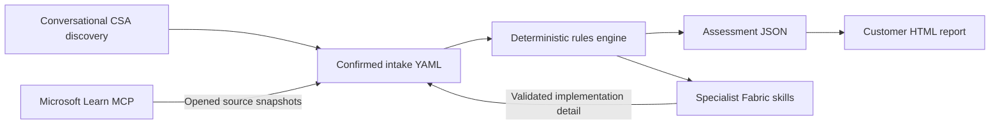

# Fabric Adoption Readiness Assistant

A conversational, evidence-aware assessment workflow for Cloud Solution Architects planning Microsoft Fabric adoption. It combines a guided Copilot interview, deterministic migration rules, Microsoft Learn evidence, specialist Fabric skills, and a polished customer-ready HTML report.

The original browser prototype remains available in `index.html`. Version 2 moves assessment decisions out of the page so the conversation, automation, and rendered report all use the same testable engine.

## Design goals

- **Conversational discovery:** Copilot asks small, workload-specific question batches instead of presenting one long technical form.
- **No guessed facts:** Missing required answers produce `Needs Discovery`; they never silently receive defaults.
- **Evidence separation:** Customer answers, assessment rules, and Microsoft Learn evidence are stored separately.
- **Reusable outputs:** JSON is the system record; the self-contained HTML file is the customer artifact.
- **Easy maintenance:** Workload questions and rules live in one YAML knowledge base.
- **Fabric depth on demand:** The skill routes confirmed issues to installed migration, authoring, operations, and cost-estimation skills.

## Architecture



The boundaries matter:

| Layer | Responsibility | Must not do |
|---|---|---|
| Conversation skill | Ask questions, confirm answers, retrieve Learn evidence | Decide readiness from intuition |
| Knowledge base | Define questions, mappings, and deterministic rules | Store customer-specific assumptions |
| Engine | Match explicit answers and expose unknowns | Browse documentation or invent defaults |
| Report renderer | Present assessed JSON | Recalculate or override assessment results |

## Repository layout

```text
.github/skills/fabric-adoption-readiness/SKILL.md  Conversational workflow
src/fabric_adoption_assistant/
	data/knowledge_base.yaml                         Questions, mappings, rules
	discovery.py                                    Next-question API
	engine.py                                       Deterministic assessment
	models.py                                       Validated contracts
	report.py                                       HTML rendering
	templates/report.html.j2                        Self-contained report design
	cli.py                                          Automation boundary
examples/sample_intake.yaml                       Grounded intake example
tests/                                            Behavioral guardrails
index.html                                        Original standalone prototype
```

## Run locally

```powershell
python -m venv .venv
.venv\Scripts\pip install -e ".[dev]"

# Show supported workloads and begin conversational discovery
.venv\Scripts\python -m fabric_adoption_assistant.cli workloads
.venv\Scripts\python -m fabric_adoption_assistant.cli questions power_bi

# Import an existing estate inventory for conversational confirmation
.venv\Scripts\python -m fabric_adoption_assistant.cli import-estate examples/sample_estate.csv `
	--customer-name "Contoso Retail" `
	--output examples/estate-import.json

# Generate consistent JSON and customer-ready HTML
.venv\Scripts\python -m fabric_adoption_assistant.cli assess examples/sample_intake.yaml `
	--json-out examples/sample_report.json `
	--html-out examples/sample_report.html

.venv\Scripts\python -m pytest -q
```

Open `examples/sample_report.html` directly in a browser. It has no server or external asset dependency and prints cleanly to PDF.

## Hackathon presentation bundle

The `demo-assets/` folder contains an editable eight-slide PowerPoint deck, an
exact two-minute narrated full-screen prototype walkthrough, a presenter runbook,
and realistic Excel/CSV/PDF demo inputs. Start with `demo-assets/BUNDLE.txt` for
the file index and live-demo sequence. The browser accepts the Excel inventory
after it is saved as CSV; PDF extraction uses the packaged CLI or Copilot
discovery workflow.

For team testing, share `demo-assets/output/Fabric_Migration_Readiness_Assistant_Team_Test_Bundle.zip`.
It contains the standalone HTML, valid assessed CSVs for Healthcare and Financial
Services, expected results, and a feedback template. The scenarios score 66% and
64% readiness with mixed Ready, Optimise, and Redesign outcomes. Extract the ZIP
and open the HTML directly in Edge or Chrome; no installation is required.

## Estate uploads

The Discovery screen in `index.html` includes an **Upload PDF or CSV** button.

CSV files are imported immediately in the browser using this contract:

| Column | Required | Meaning |
|---|---|---|
| `name` | Yes | Customer-facing workload name |
| `workload_type` | Yes | Supported canonical type or alias such as `Power BI`, `Azure SQL`, or `ADF` |
| `size_gb` | No | Non-negative approximate size |
| `notes` | No | Source notes copied without interpretation |

Every browser-imported workload is marked **Needs Discovery**. The upload does not infer feature flags or readiness.

PDFs require text extraction and conversational confirmation. Selecting a PDF in the standalone page records no workload facts because a browser-only page cannot safely call the packaged Python parser. Attach the PDF in Copilot Chat, or run `import-estate`; the skill then presents an unconfirmed inventory for review. Scanned pages with no text are reported as requiring OCR.

See `TESTING.md` for the acceptance test and customer pilot checklist.

## Microsoft Learn MCP

The branch includes `.vscode/mcp.json` configured for Microsoft's public Streamable HTTP endpoint:

```text
https://learn.microsoft.com/api/mcp
```

There is no authentication requirement. After opening the repository in VS Code, start or approve the `microsoft-learn` MCP server when prompted. The conversational skill uses `microsoft_docs_search` to discover current documentation and `microsoft_docs_fetch` to open the selected source before attaching a claim.

The endpoint and operating model are documented in the official [Microsoft Learn MCP Server overview](https://learn.microsoft.com/en-us/training/support/mcp). If the server is unavailable, the workflow must retain an evidence limitation rather than answer from model memory.

## Managing knowledge

Edit `src/fabric_adoption_assistant/data/knowledge_base.yaml` to change questions, target patterns, or rules. Every product behavior claim used with a customer should be checked against Microsoft Learn through MCP during the engagement and attached to that workload as an evidence snapshot.

When adding a rule:

1. Make the `when` condition depend on an explicit answer id.
2. Add a focused engine test proving the trigger and non-trigger cases.
3. Phrase the output as a bounded finding or validation action.
4. Do not encode volatile numeric limits unless the rule also carries a reviewed source and review process.

## Status and disclaimer

This is directional architecture guidance, not a capacity quote or automatic migration approval. Validate regional availability, current feature support, security requirements, and measured workload telemetry before commitment.
