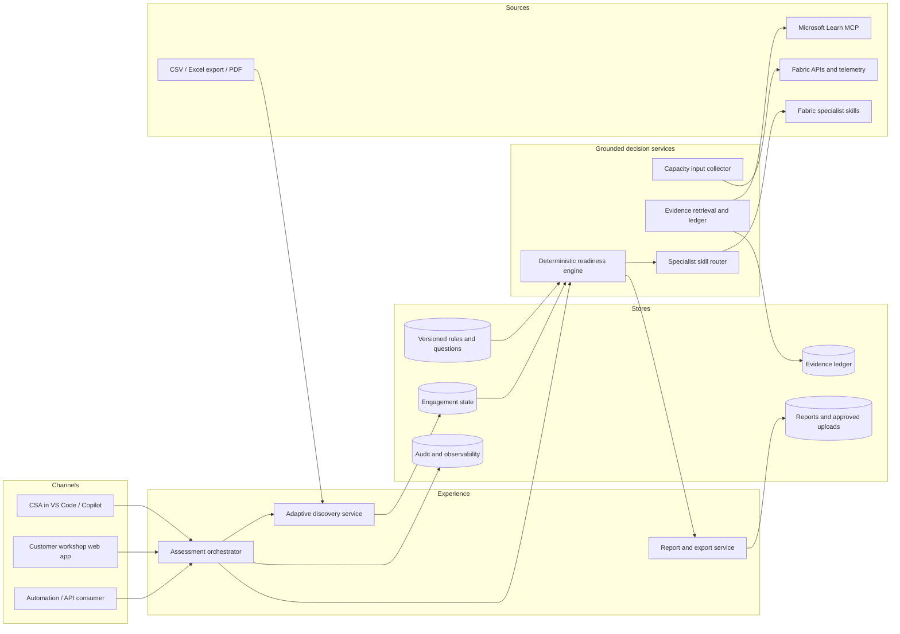
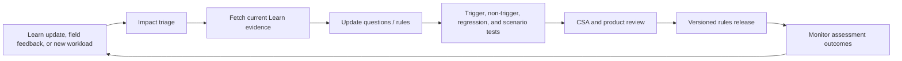

# Future Architecture - Fabric Migration Readiness and Optimisation Assistant

## Purpose

Evolve the hackathon prototype into a reusable, evidence-grounded service that multiple Cloud Solution Architects can use across customer engagements without sharing customer data or relying on individual judgement.

## Architecture principles

1. Customer-confirmed facts, current product evidence, and deterministic rules remain separate.
2. Unknown facts never receive guessed defaults.
3. Readiness is computed by a versioned engine, not by generative prose.
4. Product claims are retrieved from Microsoft Learn for the current engagement and stored with retrieval date.
5. Customer estates are isolated by tenant and engagement; no customer data is committed to Git.
6. Capacity recommendations remain directional until validated with measured telemetry and the Fabric SKU Estimator.
7. Every rules release is reviewable, testable, and reversible.

## Target logical architecture

## Production deployment pattern

| Concern | Recommended pattern | Reason |
|---|---|---|
| Web experience | Azure Static Web Apps or equivalent static hosting | Separates the self-contained UI from decision services |
| API and orchestration | Azure Container Apps or App Service | Independently deployable, autoscaling service boundary |
| Identity | Microsoft Entra ID with group-based roles | CSA, reviewer, administrator, and read-only access |
| Engagement state | Cosmos DB or Azure SQL with tenant and engagement partition keys | Isolated, auditable, resumable assessments |
| Files | OneLake or Azure Blob Storage with short retention and malware scanning | Controlled upload and report storage |
| Rules | Git repository plus signed release artifact | Peer review, versioning, rollback, and repeatability |
| Secrets/configuration | Key Vault and App Configuration | No credentials in code or assessment files |
| Evidence | Microsoft Learn MCP at assessment time plus evidence ledger | Current claims with source URL and retrieval date |
| Telemetry | Fabric APIs, Capacity Metrics, and approved source telemetry | Replaces estimates with measured workload behaviour |
| Observability | Application Insights and immutable audit events | Reliability, supportability, and decision traceability |

The first production pilot can keep VS Code/Copilot as the orchestration channel and introduce the API boundary before building a centrally hosted web experience.

## Core service boundaries

### Intake and discovery

- Accept inventory, architecture documents, and manual facts.
- Preserve source location and confirmation status.
- Reject silent classification from unconfirmed text.
- Generate the next highest-value questions, no more than three at a time.

### Assessment engine

- Consume validated intake plus a ruleset version.
- Return disposition, target pattern, blockers, optimisations, open questions, and confidence coverage.
- Remain deterministic and independently testable.

### Evidence service

- Search and fetch Microsoft Learn at assessment time.
- Record title, URL, narrow supported claim, retrieval date, reviewer, and affected rule.
- Expire or flag stale evidence rather than silently treating it as current.

### Capacity service

- Collect volume, movement, concurrency, refresh overlap, Spark duration, SQL pressure, real-time event rate, growth, and region.
- Use observed telemetry when available.
- Produce Fabric SKU Estimator inputs and test-plan recommendations, not an unqualified SKU promise.

### Report service

- Generate customer HTML/PDF, machine-readable JSON, and an internal evidence appendix from one assessment record.
- Never recalculate disposition in the rendering layer.

## Engagement isolation

Use a compound identity of `organisation_id`, `engagement_id`, and `assessment_version`. Customer artifacts are encrypted, access-controlled, retention-bound, and excluded from source control. Rules and generic scenario templates can be shared globally; customer facts cannot.

## Rules and evidence release lifecycle

Release metadata should include rules version, evidence retrieval date, reviewer, test result, changed workloads, and migration notes. Existing customer reports retain their original rules and evidence versions.

## Roadmap

### Phase 0 - Demonstrator

- Standalone HTML, deterministic prototype rules, sample scenarios, deck, and video.
- Local browser storage and manual evidence validation.

### Phase 1 - CSA pilot

- Use the workspace skill and discovery agent.
- Generate validated YAML, JSON, and customer HTML through the Python engine.
- Pilot with 3-5 CSAs and 5-10 estates.
- Measure time to first useful output, unsupported-claim rate, correction rate, and recommendation usefulness.

### Phase 2 - Governed service

- Add Entra identity, API boundary, engagement store, audit events, evidence ledger, retention controls, and CI/CD.
- Introduce rules release governance and automated freshness checks.
- Integrate Fabric telemetry for measured sizing inputs.

### Phase 3 - Scaled and extensible

- Multi-team service with role-based templates and portfolio views.
- Add Snowflake, Oracle, Teradata, AWS, and GCP source adapters.
- Support approved partner rulesets without weakening evidence or isolation boundaries.
- Benchmark recommendations against migration outcomes and tune rules through reviewed releases.

## Non-functional requirements

| Area | Initial target |
|---|---|
| Explainability | Every disposition traces to confirmed facts and a rule; current claims trace to opened evidence |
| Security | Entra authentication, least privilege, encryption, no secrets in artifacts |
| Isolation | No cross-engagement reads; customer data never enters the shared rules repository |
| Reliability | Idempotent assessment execution and recoverable engagement state |
| Performance | First inventory view under 5 seconds for 500 workloads; report generation under 30 seconds |
| Accessibility | WCAG 2.2 AA for hosted UI and report |
| Auditability | Immutable record of rules version, evidence, reviewer, and report version |
| Portability | JSON/YAML contracts and self-contained customer HTML |

## Architecture decision gates

Before production build, confirm data classification and retention, hosting ownership, tenant model, identity roles, telemetry permissions, Learn MCP availability, rules review board, support model, and whether customer-facing hosting is required for the first pilot.
